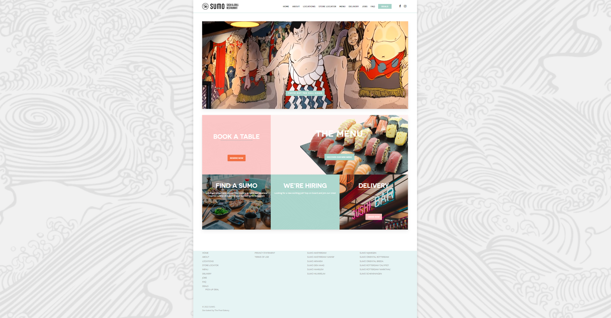
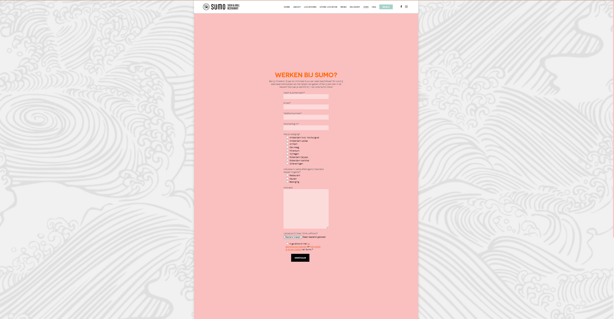
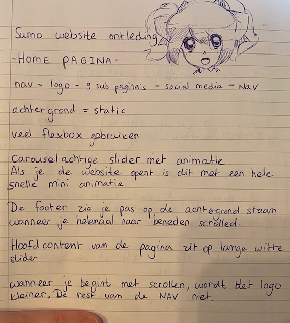
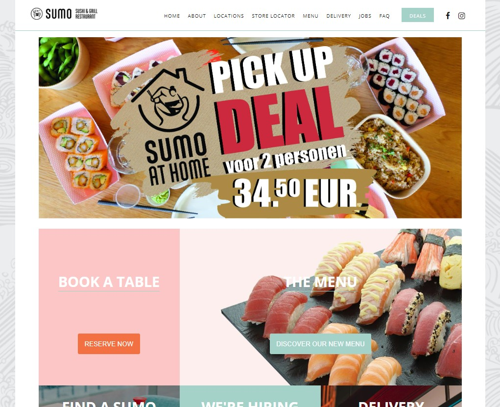
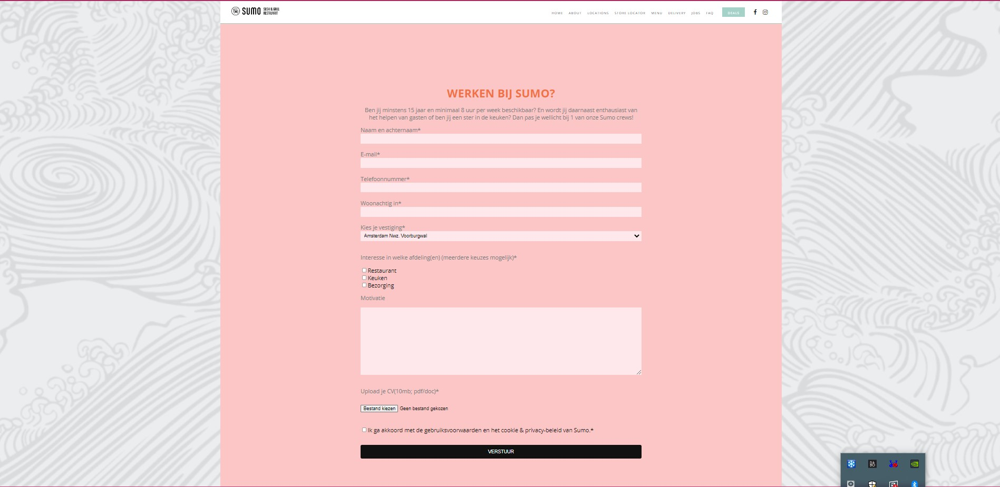

# Procesverslag
Markdown is een simpele manier om HTML te schrijven.  
Markdown cheat cheet: [Hulp bij het schrijven van Markdown](https://github.com/adam-p/markdown-here/wiki/Markdown-Cheatsheet).

Nb. De standaardstructuur en de spartaanse opmaak van de README.md zijn helemaal prima. Het gaat om de inhoud van je procesverslag. Besteedt de tijd voor pracht en praal aan je website.

Nb. Door *open* toe te voegen aan een *details* element kun je deze standaard open zetten. Fijn om dat steeds voor de relevante stuk(ken) te doen.

## Jij

uitwerken voor kick-off werkgroep

### Auteur:
Nicole Schilder 

#### Je startniveau:
Rood
#### Je focus:
Responsive
 

## Je website

uitwerken voor kick-off werkgroep

### Je opdracht:
[Sumo restaurant](https://restaurantsumo.com/)

#### Screenshot(s) van de eerste pagina (small screen): 
Home pagina  

#### Screenshot(s) van de tweede pagina (small screen):
Jobs Pagina  

 

## Breakdownschets (week 1)

uitwerken na afloop 2e werkgroep

### de hele pagina: 

## Voortgang 1 (week 2)

uitwerken voor 1e voortgang

### Stand van zaken
Ik heb de html af en kan beginnen met de css. Ik maakte me eerst zorgen dat ik de content niet zou kunnen vinden, maar ik heb alles toch kunnen vinden daknzij het inspecteren van de originele website. Ik vond het ook vrij moeilijk om te bepalen hoe de html eruit moest komen te zien. Gelukkig is dit goed gegaan.

### Agenda voor meeting
samen met je groepje opstellen

| Nicole         |                    |              |                  |
| ---            | ---                | ---          | ---              |
| html bespreken | en dit             | en ik dit    | en dan ik dat    |
|                | dit als er tijd is | nog een punt | dit wil ik zeker |
| ...            | ...                | ...          | ...              |

### Verslag van meeting
hier na afloop snel de uitkomsten van de meeting vastleggen

- Nu moet je gewoon verder met je css.

## Voortgang 2 (week 3)

uitwerken voor 2e voortgang

### Stand van zaken
Ik heb eigenlijk niet echt veel meer gedaan. Ik heb alleen mijn html een beetje aangepast, maar ik moet nog steeds beginnen aan mijn css.

### Agenda voor meeting
samen met je groepje opstellen

| Nicole         | student 2          | student 3    | student 4        |
| ---            | ---                | ---          | ---              |
| ik heb niks te | en dit             | en ik dit    | en dan ik dat    |
| bespreken      | dit als er tijd is | nog een punt | dit wil ik zeker |
| ...            | ...                | ...          | ...              |

### Verslag van meeting
hier na afloop snel de uitkomsten van de meeting vastleggen

- Ik moet gewoon beginnen met de css.

## Toegankelijkheidstest (week 4)

uitwerken na test in 8e voortgang

### Bevindingen
Lijst met je bevindingen die in de test naar voren kwamen:

#### Titel eerste bevinding
Ik ben erachter gekomen dat je met een form de label en input kunt koppelen doormiddel van een id, waardoor het voor screenreaders duidelijk wordt wat 
de input moet zijn.

## Voortgang 3 (week 4)

uitwerken voor 3e voortgang

### Stand van zaken
Ik zit niet zo lekker in mijn vel en daardoor ben ik een tijdje niet op school geweest. Hierdoor heb ik ook niks om te bespreken.

## Eindgesprek (week 5)

uitwerken voor eindgesprek

### Stand van zaken
Ik heb het eingesprek niet gedaan. Ik ben gegaan voor de herkansing. Dus ik heb voor de rest alles gemaakt in een week. Alles ging vrij okay. De nav was best goed te doen met css. Alleen toen ik bij de slider kwam die ik moest maken, storte alles in elkaar. Ik kreeg het maar niet voor elkaar. Hierdoor werd ik enorm ontmoedigd. Toen heb ik even rust genomen en ben ik de dag erna verder gegaan. Ik heb de slider laten zitten. Vanaf toen ging het best goed. Ik heb de website volledig repsonsive gemaakt. Ik ben wel begonnen met een groot scherm ipv een klein scherm. Ik heb zeker geleerd om dit de volgende keer anders te doen. Ik ben erg vooruit gegaan op het schrijven van comments in mijn code.

hier screenshot(s) van je eindresultaat

## Bronnenlijst

continu bijhouden terwijl je werkt

Nb. Wees specifiek ('css-tricks' als bron is bijv. niet specifiek genoeg).

1. https://www.w3schools.com/css/css_form.asp (voor het formulier)

